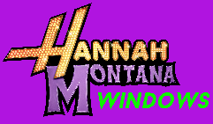

# Hannah Montana Windows (early WIP)

(yes, this is real)  

Since 2009, Linux users have been able to experience the wonders of Hannah Montana infused directly into their OS via [Hannah Montana Linux](https://hannahmontana.sourceforge.net/). Unfortunately, this has not been the case for users of the superior Windows operating system, until now.  
Hannah Montana Windows is a modded version of Windows XP, complete with enough neon-pink computational bling to make even the most commited Linux users switch to Windows.  

## Current Status

It's very early days, the script just builds an unmodified XP iso.

## Prerequisites

Hannah Montana Windows does not contain any Microsoft OS materials. You must provide these yourself.

Replace `isos\source.iso` with an unmodified copy of Windows XP 32-bit SP3 en_us VL. This should have an MD5 has of `b`.

Replace `slipstream\servicepacks\sp3.exe` with a copy of the Windows XP Service Pack 3 update. This should have an MD5 hash of `BB25707C919DD835A9D9706B5725AF58`.

## Building

Run the Build-Iso.ps1 script.